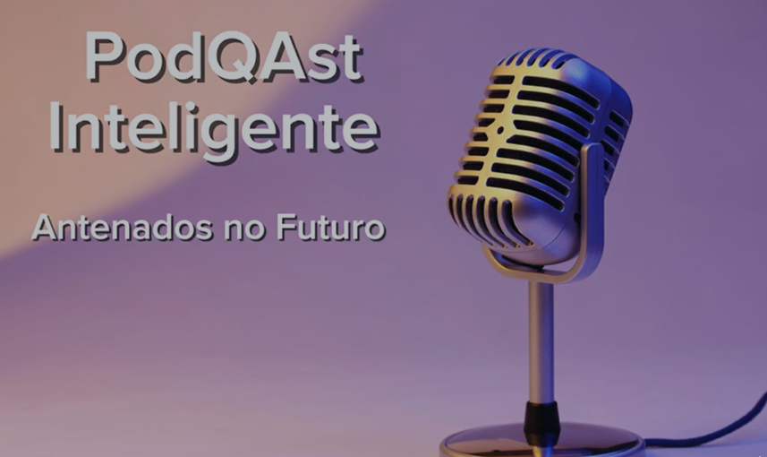

# Projeto Podcast Gerado por I.A.s

 > ℹ️ **NOTE:** Este é o repositório desenvolvido durante o Bootcamp Santander 2024 - Fundamentos de IA para Devs [DIO](https://dio.me)

Projeto com o objetivo de gerar um podcast utilizando ferramentas de IA através de engenharia de prompts.

Utilizei uma esteira de prompts para gerar cada etapa do processo criativo.

## 💻 Tecnologias utilizadas no projeto

- [ChatGPT](https://chat.openai.com/) 
- [ElevenLabs](https://beta.elevenlabs.io/)
- [Capcut](https://www.capcut.com/pt-br/)

## ✨ Como foi feito ?

- Roteiro gerado via chatgpt
- Audio gerado pela elevenLabs
- Capcut para tratar aúdio e adicionar sons de fundo

## 🛠️ Instruções de execução

Utilizei os prompts abaixo no ChatGPT

- 🤖 1. Prompt para o título: 
  `"Você é um roteirista de podcast, e vamos criar um podcast de tecnologia, focado em Qualidade de Software (QA) e Testes  e eu gostaria de uma ajuda sua para criar 5 sugestões
de nomes criativos para um podcast de QA focado em inovações e inteligência artificial
O podcast vai falar sobre dicas e novidades sobre o mundo do QA e Testes e o que está acontecendo no mercado de inteligência artificial e o uso de IA em QA e Testes de Software"`

- 🤖 2. Prompt para o roteiro: 

"O formato do roteiro deve ser
[INTRODUÇÃO]
[CURIOSIDADE 1]
[CURIOSIDADE 2]
[FINALIZAÇÃO]

{REGRAS}

- no bloco [INTRODUÇÃO] substitua por uma introdução iguais as introduções dos vídeos do Podcast  'mamilos', como se fossem escritos por Ju Valawer e Cris Bartis
- no bloco [CURIOSIDADE 1] substitua por uma curiosidade Qualidade de Software
- no bloco [CURIOSIDADE 2] sobre uma ferramenta de IA para Testes 
- no bloco [FINALIZAÇÃO] substitua por uma despedida cool com o final 'Eu sou a Vivi e esse foi o PodQAst Inteligente dessa semana'
- use termos de fácil explicação
- O podcast vai ser apresentado somente por uma pessoa, chamada Vivi
- O podcast deve ser curto

{REGRAS NEGATIVAS}

- Não use muitos termos técnicos
- Não ultrapasse 5 minutos de duração"

